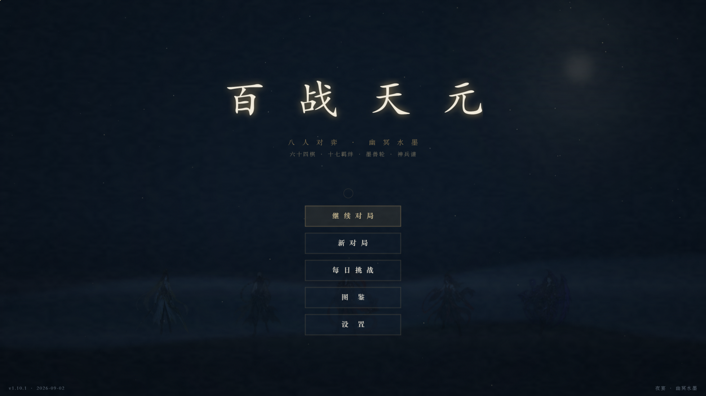
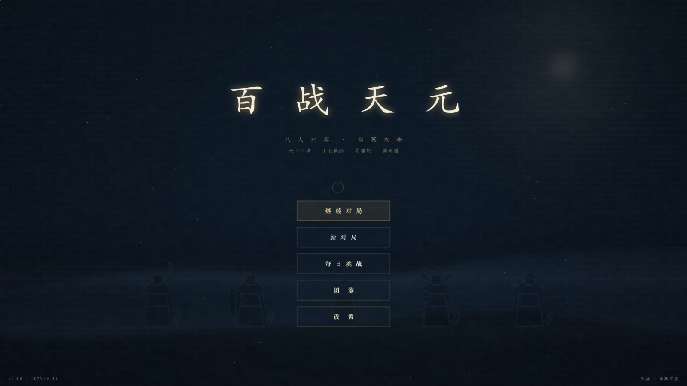
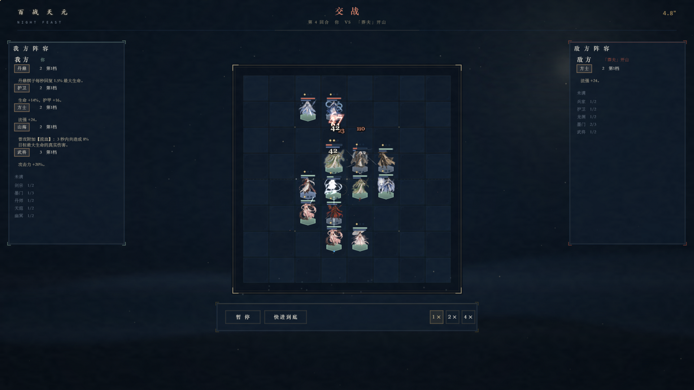

# 百战天元 · TIAN YUAN

> 天地初分，墨与纸未判。有神将、荒兽、妖灵、鬼差共弈一局，胜者执笔，重写山河。

一款**商业级单机自走棋**：八人对局（你 + 七名 AI 诸侯），64 名棋子、17 条羁绊、
8 组件 36 成品的全配方装备体系（任意两件组件必有合成）。单局 28~37 回合、约 25~40 分钟
（实测平均约 27 分钟）：
开局引导战教学，第 1/7/13/19/25 回合五场墨兽轮供给装备（全员保底 + 胜场追加，
五轮全败也有 19 组件 + 70 金的下限由表结构保证），
第 4/10/16 回合三次奇遇恩赐；三星五费携「天命护持」成为可围绕构筑的终局面额。
技术栈 Phaser 3 + TypeScript + Vite；视觉与音效由代码程序化生成
（纸纹 / 颗粒 / 图标 / 全部打击音），入库资产三源：64 张 AI 生成棋子立绘、
羁绊小篆 22 字子集、四曲 CC0 典藏音乐（可开关，关即回落程序化五声音阶合成），
风格为「夜宴 · 幽冥水墨」（Night Feast）。

```
npm ci           # 按锁文件安装依赖（Node ≥ 22.5，.nvmrc 已钉 22.5）
npm run dev      # 开发服务器 → http://localhost:5199
npm test         # 核心行为测试（vitest）
npm run build    # tsc 严格类型检查 + 生产构建 → dist/
npm run qa       # 交付门禁：类型 + 架构边界 + 核心行为 + 生产构建
```

一键启停（含端口占用自动清理与退出释放）：Windows 双击/命令行 `start.bat`（`stop` / `status` / `restart` 子命令可用）；Git Bash 用 `start.sh`。

## 打包发布（任意电脑游玩）

一条命令：`npm run release`（版本一致性 + 类型/边界 + 核心行为 + 依赖/资源审计 + 双形态构建 + 产物体检 + 打 zip），产物在 `release/`：

| 产物 | 用法 |
|---|---|
| `百战天元.html`（单文件，四曲音乐内联） | **双击即玩**：用 Chrome / Edge / Firefox 打开；微信、U 盘、邮件直发，接收方零安装零依赖 |
| `dist-web/` | **静态托管**：整体上传云 OSS 或公司内网服务器；局域网试玩可执行 `npx serve dist-web` 后分享地址 |
| `百战天元-<版本>-web.zip` | 上述两者 + 使用说明 + 第三方授权清单，分发归档 |

要点：单文件形态无任何外链（发布脚本内置体检，`data:` 内联之外一律判失败——
相对路径、绝对 URL、`blob:`，覆盖属性写法、CSS `url()`、`@import`，以及
JS 的动态 `import()`/`fetch` 网络调用；打包器自带的 modulepreload 补丁按已知
固定片段豁免，不产生误报）；相对路径 `base './'`，任意子目录托管可用。发布
工具链跨平台（Node zip，Windows/macOS/Linux 一致）。存档保存在**玩家本机浏览器**
的 localStorage：普通对局与每日挑战**分键存取**（`inkarena.save.v3` /
`inkarena.save.v3.daily`），互不覆盖——玩每日挑战不会动普通进度，任一模式终局
或放弃只清本模式存档；损坏的存档键（配额半截写入 / 手动改坏 / 旧版本残留）在
「继续」入口判定与读档时都会被自动清理并判无存档（有 v2 旧档仍会走无损迁移），
不会把入口误点亮成"继续"；**写盘失败（配额满）会即时提示玩家**，不再静默
读到旧档回退若干回合；音乐在窗口失焦时自动静音，回到前台恢复。

> 开发模式下 `window.__arena` 暴露 Phaser 实例；`window.__qa` 采集 console 的
> 报错与警告（只抄不吞，原始 console 行为不变）；`window.__tftAudio`（仅 dev）
> 供自动化验收静音音频链；`Ctrl+~` 呼出实验控制台（金币/等级/生命/器件/快进）。

## 操作

| 动作 | 方式 |
|---|---|
| 买子 / 上阵 | 点商店卡买入 → 拖到棋盘；`1-5` 键（含数字键盘）直购对应卡位；轻点棋子选中、再点目标格落子；同星级三张自动合成升星；同名棋子允许多张同时上场（羁绊按拥有唯一计数） |
| 装备 | 拖器匣器件到棋子身上（身上可合成的组件自动吞并）；组件拖到器匣内另一组件上直接合成（悬停即预览成品）；批量或单件卸载都严守器匣容量——放不下整体拒绝并提示，绝不"卸一半丢一半"；「卸 载」钮点选后点棋子，全身装备一键回器匣 |
| 卖出 | 拖棋子到右下朱印「售」区（含装备的棋子按住拖入，组件返还器匣）；2★/3★ 需二次确认 |
| 刷新 / 升级 / 锁店 | 底部操作区；`D` 刷新、`F` 买经验、`空格` 准备完毕（任何浮层打开时快捷键一律让路） |
| 撤销 | 准备阶段内任意操作可回退——完整快照：金币、商店、器匣、棋盘与备战席、等级/经验、共享卡池计数、本回合未领取的奇遇恩赐与随机流游标一并还原；撤销后重摇与被撤销那次逐位一致，恩赐领完再撤销也不会蒸发 |
| 羁绊 | 悬停左轨徽章看当前档效果；**点击钉住成员名单卡**（该族全部棋子的立绘网格：拥有的金框点亮、未拥有的压暗，头部给「已上阵 x / 全 N」）——凑羁绊"差哪一口、缺哪个子"一眼可见；轨内可滚动（内容超出视口时滚轮查看），滚动后悬停笺/成员卡仍贴所点徽章的实时位置；成员卡钉住期间棋盘快捷键同样让路；ESC / 点空白 / 再点同徽章收起，买子卖子后计数原位刷新；图鉴「羁绊」册整行点击展开同一份成员网格 |
| 一键布阵 / 一键装备 | 按职业纵深自动站位、按放大原则自动配装 |

## 架构

```
src/
├── core/      战斗内核 —— 完全无头、完全确定、30Hz 固定步长
│   battle.ts  主循环：目标选择 → 前摇 → 结算 → 死亡 → 超时裁定
│   unit.ts    单位运行时与有效属性（effAtk/effAspd/effArmor…）
│   traits.ts  17 条羁绊的机制实现（数值经 tune() 查调参表）
│   skills.ts  技能行为的完整实现
│   items.ts   装备三层生效：面板 → TraitState 修正 → 行为钩子
│   config.ts  所有手感与数值框架常量的单一真源
├── data/      配置表：champions(64) / traits(17) / items(44：8 组件 + 36 成品) / tuning
├── game/      对局层：经济、商店、卡池、配对、AI 原型、奇遇、存档、撤销、回放
│              （存档按模式分键：普通档 inkarena.save.v3 / 每日档 .daily；墨兽与奇遇真源表在 DESIGN §二/§六）
├── render/    表现层
│   ├── view/    视图基元：调色板、布局常量、纹理与烘焙、场景转场、演出偏好
│   ├── board/   棋盘与单位视觉：棋板、棋子、特效、装备/羁绊图标
│   ├── art/     运行期美术资产：item / piece（AI 立绘切片入库）
│   ├── game/    对局面板与输入（InputController 命中检测独立模块 hitTest）
│   └── scenes/  场景：菜单 / 备战 / 战斗 / 结算 / 图鉴（各场景自持金环悬停桥接，避免切场景后失效）
├── ui/        界面组件：面板套件、棋子卡、羁绊行
├── audio/     音频执行：合成音三总线 + 典藏曲目调度（失焦自动静音；授权曲目并行解码、单代际看守，失败回落程序化合成）
└── music/     曲目清单与授权元数据（CC0，`?url` 导入适配双形态，manifest 校验 id/license/sha256/URL 完备性）
```

### 三条不可妥协的设计契约

1. **内核无头**：`core/` 不引用任何渲染 / DOM / 时间 API，模拟器与实机跑同一份代码。
2. **完全确定**：同 seed + 同输入 ⇒ 逐字节一致的事件流。回放、测试、平衡模拟全部依赖这一点。
3. **资源守恒**：共享卡池买卖回流、装备合成与出售返还器匣（卖出带装棋子成品拆回组件——
   专项测试看守）、撤销是完整状态快照、满席「合成即上场」后席位始终收敛 9 格 ——
   任何路径下棋子与器件不凭空产生或消失（买入失败同样整份快照回滚，随机流游标随撤销
   一并还原，付费动作不存在"撤销白嫖"通道）。

分层依赖由 `npm run check:boundaries` 按 `docs/DEVELOPMENT.md` §3.3 对七层全部文件
加 src 根组合文件（`main.ts` / `version.ts`）强制执行：内核三层零 npm 包依赖，
`ui` 对对局状态只读（白名单模块），`audio`/`music` 不读对局、不影响战斗结果。

分层动机：平衡改动只碰 `data/` 与 `config.ts`；新棋子 = 一条数据 + 一组技能参数；
表现层怎么改都不影响战斗结果。

## 内容设计哲学

- **羁绊是机制质变，不是数值堆砌**。17 条羁绊各归一类（站位 / 技能 / 经济 / 生存 / 节奏），
  在档位跳变处改变玩法而非放大数字。克制关系是结构性的：
  反伤克攻速、真伤克魔抗、AoE 克群召、刺客克后排。
- **技能是配置驱动**。行为 kind × 目标选择 × 参数组合出 64 个技能；
  文案由 `{atk}/{sp}/{threshold}/{dur}` 模板回填 —— 数值与描述永不脱节（有测试钉住）。
- **装备必须带机制**。纯属性翻倍不改变决策；「击杀回复 18% 生命」「治疗溢出转护盾」才改变构筑。
  同名叠加口径全表统一：面板按件求和，行为钩子取最强一件。
- **终局与保底都有确定结构**。三星五费「天命护持」（数值乘区 + 开战护盾 + 全能吸血 +
  免控）是"大概率接管终局、但集火与真伤仍是解法"的面额；墨兽轮掉落按真源表
  全员保底、胜场只多不少 —— 装备下限由表结构保证，不由胜率期望保证。

## 平衡工具链

数值不靠感觉，全部走「迭代式调参 + 统计反馈」。工具链 2026-09-02 重建为
**`npm run balance -- <command>`**（[balance/](./balance/README.md)：fork 进程池并行
+ SQLite 工件库 + CRN 配对统计；目标函数是**相对平衡与百花齐放**——阵容带
[44,58] + 边带 [20,80]，不是压平极差）。实验工件落在 `balance/out/balance.db`
（gitignored；`trend` 跨版本断面、`units`/`items`/`traits` 维分析都从库读数）。
四维分析全覆盖：

| 命令 | 维度 | 回答什么问题 |
|---|---|---|
| `matrix` | 阵容 | 九套预设对拍矩阵（双向平均）、阵容带/边带越带读数、超时率，入库 |
| `sweep` / `ab` | 阵容 | 参数灵敏度扫描（CRN 配对消噪）/ 克制边定向 A/B（`--set` 键值校验 + 覆盖路径在 fork 前一次性预检，非法路径不耗算力即报错） |
| `units` | 棋子 | 逐单位场均伤害/承伤/类型构成/施法/生存率榜单 |
| `traits` | 羁绊 | 每条羁绊压制归零 vs 基线的边际胜率贡献 |
| `items` | 装备 | 单件边际 / 合成正收益 / 同件堆叠递减 / 异件协同有界（logit 口径） |
| `trend` / `selftest` | — | 跨版本断面趋势（读库）/ 战役前五关门禁（含进程池=串行逐位一致、SQLite 外键与商店/音乐清单校验） |
| `match` / `shop` / `gold` / `bigorigins` / `legend` | — | 局长与 AI 极差 / 商店概率与刷店成本（`--t<等级>` 概率行覆盖走当次注入，源码真源只读）/ 造价带 / 大羁绊天花板 / 天命专项 |
| `bench` / `beast` / `roster` / `audit` / `diag` / `probe` | — | 算力基准 / 墨兽轮专项 / 阵容表 / 断面对账 / 状态诊断 / 组合探针（支撑速查，见 `balance/README.md`） |
| `npm run check:boundaries` | — | 架构边界：越层依赖 / 浏览器 API / 非确定性随机源，名单外引用即失败 |

进程池对单作业设有硬超时，fork→就绪的初始化阶段同样上钟，且「作业中途子进程退出」整池失败兜底 ——
任何情况下命令不永久挂起；收尾统一断开 IPC 并清理定时器句柄；工件库启用外键与缺口显式校验，
`sweep`/`ab` 的覆盖路径在派发前一次性预检；item 作业入口显式复位补丁，混合作业池互不污染。

当前平衡断面、先手偏差、克制边和局长数据见
**[docs/DESIGN.md](./docs/DESIGN.md)**（§十二 当前平衡数据），质量验收见 **[docs/QA.md](./docs/QA.md)**。

## 技术选型

| 选择 | 理由 |
|---|---|
| Phaser 3.80 | 2D 场景图、RenderTexture 烘焙、tween、粒子一站式 |
| TypeScript strict | 战斗内核的数值口径（暴击单结算、抗性上限、吸血语义）靠类型与测试固化 |
| Vite 5 | 秒级冷启动；应用代码与 Phaser 独立分包 |
| Vitest | 风险驱动的核心行为防线：战斗、资产、进度与交互 |
| 轻素材管线 | 纸纹、颗粒、图标、音效全部程序化；立绘 64 张 / 小篆子集 / CC0 音乐三源入库，`?url` 导入自动适配双形态 |
| Node ≥ 22.5 | 平衡工具链经 `node:sqlite` 零新依赖持久化工件（`engines`/`.nvmrc`/CI 同口径） |
| DPR 渲染底座 | 画布缓冲 = 1920×1080 × K（K=min(dpr,2)），相机 zoom=K 锚点居中 —— 高分屏 1 逻辑 px = 1 设备 px；指针坐标经 screenToWorld 咽喉换算，高分屏拖拽/命中零偏移 |

## 视觉方向

「夜宴 · 幽冥水墨」：夜蓝墨为底、米金宣为亮面、朱砂是唯一的热色、旧金点将；
楷/宋/mono 三线排版、直角界格体系、朱文印章（白名单 3 处）表达不可逆操作；
全窗夜色山海背景 + 自定义金环光标（各场景自持悬停桥接，切场景后不失效；InputController 定向清理避免双发），准备与战斗共用同一张大漆盘
（战斗时棋盘层整体放大 1.25 倍，棋子与特效随之，面板与顶栏不受影响）。
棋子立绘为 64 张 AI 生成透明底 PNG（`render/art/piece/ai/`），原生分辨率烘焙、星级银/金描边与墨兽罩染由管线程序派生；
羁绊徽章为小篆单字 + 金线档位（未激活灰 / N 档 N 圈金线）。
完整规范（色板 / 字阶 / 大漆盘 / 夜宴编排 / 特效几何语义 / 动效分级）见
**[docs/ART_BIBLE.md](./docs/ART_BIBLE.md)**。

> **适配口径**：面向桌面 16:9（1920×1080 设计分辨率，`Scale.FIT` 等比缩放）；
> 平板 / 竖屏按同口径等比缩放，非 16:9 区域留白居中，竖屏不做专项优化
> （竖屏卷轴布局已在 ART_BIBLE §9.7 立项 P1–P3，见其说明）。

| 主菜单 | 备战 | 交战 |
|---|---|---|
|  |  |  |

## 文档索引

全部工程文档集中到 **[docs/](./docs/)**，导航与文档间关系见 **[docs/README.md](./docs/README.md)**：

- **[DESIGN.md](./docs/DESIGN.md)** —— 设计说明书：核心循环、经济、羁绊与克制环、装备、
  战斗内核契约、AI、平衡方法论与当前数据（墨兽/奇遇真源表与 Node 22.5 工件库口径同步）
- **[DEVELOPMENT.md](./docs/DEVELOPMENT.md)** —— 开发全流程：需求、边界、实现、验证、提交、同步与回退
- **[QA.md](./docs/QA.md)** —— 质量规范：风险分层、门禁、专项验证与通过标准（CI Node 22，`balance` 需 SQLite）
- **[ART_BIBLE.md](./docs/ART_BIBLE.md)** —— 美术圣经：色板、字体、立绘与徽章体系、特效与 UI 规范
- **[VERSIONING.md](./docs/VERSIONING.md)** —— 版本号、CHANGELOG、正式发布与版本回退
- **[CHANGELOG.md](./docs/CHANGELOG.md)** —— 更新日志（1.0.0 起按版本归档）
- **[UPGRADE.md](./docs/UPGRADE.md)** —— 五阶段重构升级计划（v3，执行归档）
